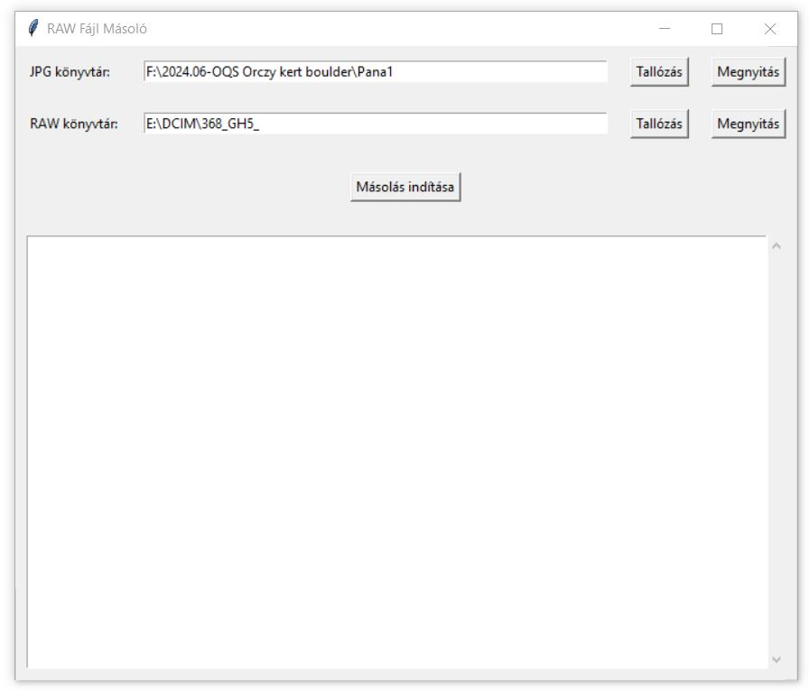

# Előnézet

# Használat

Ez a program segít a JPG fájlokhoz tartozó RAW fájlok másolásában egy megadott könyvtárból egy másikba. A program grafikus felhasználói felülettel (GUI) rendelkezik, amely lehetővé teszi a könyvtárak kiválasztását és a másolási folyamat nyomon követését.